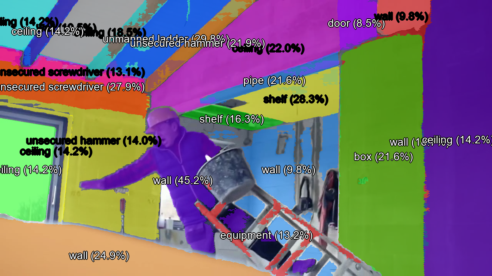
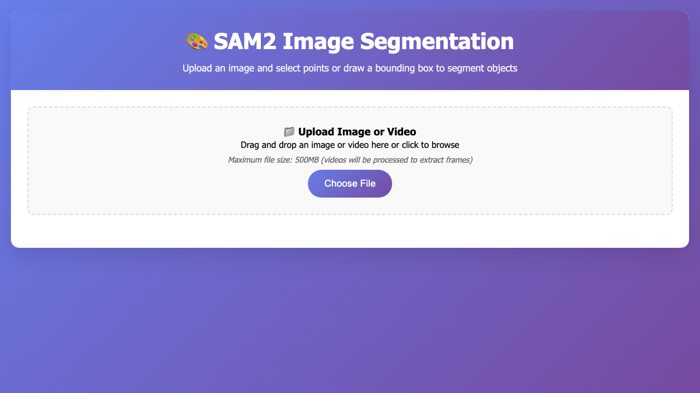
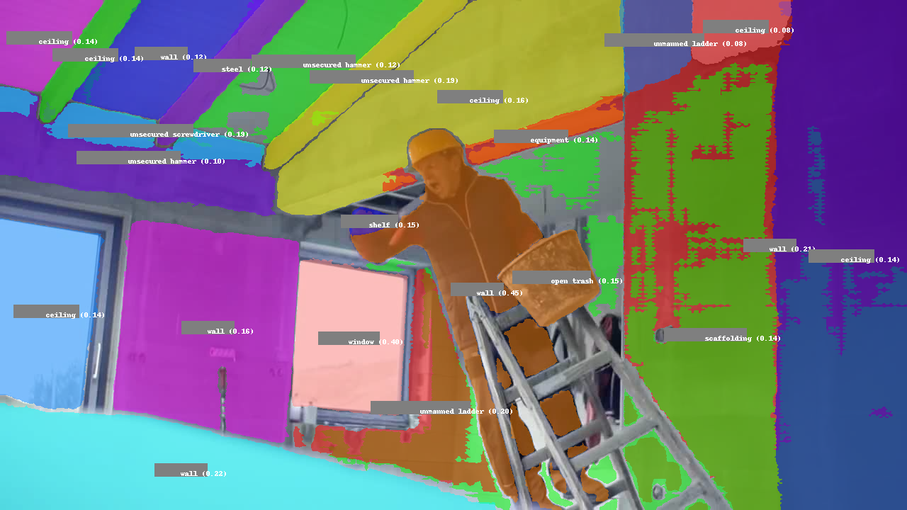
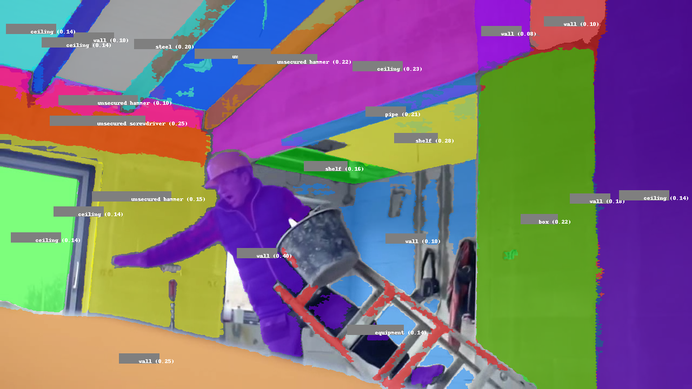
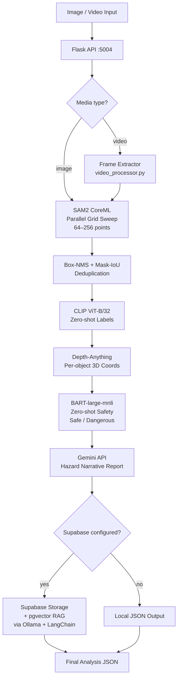
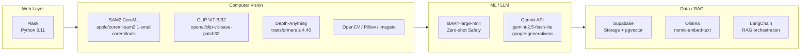

# anomalai

**Real-time workplace safety analysis: parallel computer vision + zero-shot ML + LLM hazard reporting.**

Anomalai ingests images or video from a construction or industrial site and returns per-object 3D coordinates, CLIP zero-shot labels, BART safety classification, and a Gemini hazard narrative — all driven by a CoreML SAM2 segmentation pipeline that sweeps the frame with a parallel grid.

---

## Demo

### Parallel-grid segmentation + CLIP labels — live construction scene



*24 masks detected in a single frame via parallel grid sweep. CLIP labels include `unmanned ladder`, `unsecured hammer`, `unsecured screwdriver`, `shelf`, and structural elements. 7 of 24 objects flagged dangerous by BART zero-shot classifier.*

---

### Gemini hazard report — live output

From `docs/demo/gemini-hazard-report.json` (real Gemini API call on the scene above):

> - An unsecured ladder is tipping over, causing a worker to fall.
> - The worker is carrying a bucket while climbing, preventing them from maintaining three points of contact with the ladder.
> - Unsecured electrical wires are dangling from the unfinished ceiling structure.
> - The worker is missing essential personal protective equipment, specifically protective gloves and safety glasses.

BART zero-shot safety classification (`docs/demo/safety-classification.json`): **7 hazards flagged** across 24 detected objects (pipe, unsecured screwdriver ×2, shelf ×2, unsecured hammer ×2) at confidence threshold α=0.3.

---

### Web UI



**Video pipeline output** (frames 0 and 10, full analysis in `docs/demo/video-analysis.mp4`):

| Frame 0 | Frame 10 |
|---------|----------|
|  |  |

---

## Architecture



---

## Tech Stack



| Layer | Technology |
|-------|-----------|
| Web | Flask, Python 3.11 |
| Segmentation | SAM2 CoreML (`apple/coreml-sam2.1-small`), coremltools |
| Labeling | CLIP ViT-B/32 (zero-shot, no training) |
| Depth | Depth-Anything (transformers ≥ 4.40) |
| Safety | BART-large-mnli zero-shot classification |
| Hazard Report | Gemini API (`GEMINI_MODEL` env, default `gemini-2.5-flash-lite`) |
| RAG (optional) | LangChain + Ollama `nomic-embed-text` + Supabase pgvector |
| Storage (optional) | Supabase (storage + metadata) |
| Image utils | OpenCV, Pillow, imageio |

---

## Highlight: Parallel Grid Segmentation

The core performance feature is a threaded SAM2 grid sweep in `app.py` (`parallel_grid_segmentation`). It fans a 64–256 point grid across the frame using `ThreadPoolExecutor`, collects raw masks in parallel, then deduplicates with box-NMS and mask-IoU filtering — achieving **2–4x speedup** over sequential SAM2 on multi-core hardware, with per-batch garbage collection to cap memory under load.

See [PARALLEL_PROCESSING.md](PARALLEL_PROCESSING.md) for implementation details, tuning parameters, and benchmarks.

---

## Setup (macOS)

> **Core CV pipeline (SAM2 + CLIP + Depth + BART) runs without Supabase, Gemini, or Ollama.** Those are optional — configure only what you need.

```bash
# 1. Download CoreML models
python scripts/download_models.py

# 2. Configure environment
cp .env.example .env
# Edit .env — at minimum set GEMINI_API_KEY for hazard reports.
# Add SUPABASE_URL + SUPABASE_KEY for storage/RAG.

# 3. (Optional) Set up Supabase schema
#    Run setup_database.sql in your Supabase SQL Editor.

# 4. Install dependencies
pip install -r requirements.txt

# 5. Run
python app.py
# Serves on http://127.0.0.1:5004
```

**Optional services:**

| Service | Required for | Env vars |
|---------|-------------|---------|
| Gemini API | Hazard narrative report | `GEMINI_API_KEY`, `GEMINI_MODEL` |
| Supabase | File storage + pgvector RAG | `SUPABASE_URL`, `SUPABASE_KEY` |
| Ollama (`nomic-embed-text`) | OSHA/RAG embeddings | Ollama running locally |

---

## Testing

```bash
pip install pytest
pytest -m "not smoke"
```

49 tests pass with all external services mocked (Supabase, Gemini, Ollama). A model-gated smoke test suite (`-m smoke`) requires the CoreML SAM2 model to be present locally — skip it in CI.

---

## Project Structure

```
app.py                  # Flask server, parallel_grid_segmentation, main pipeline
geometry.py             # 3D coordinate calculation from depth maps
vocabulary.py           # CLIP label vocabulary and candidate management
settings.py             # Centralised config and env-var loading
script.py               # SAM2 CoreML wrapper
safety_classifier.py    # BART zero-shot safe/dangerous classification
rag_system.py           # LangChain + Ollama + pgvector RAG
supabase_database.py    # Supabase storage and metadata client
video_processor.py      # Frame extraction and video pipeline
scripts/                # download_models.py and utilities
tests/                  # pytest suite (49 tests, externals mocked)
docs/demo/              # Live demo assets (segmentation, hazard reports, video)
```

---

## Deep-Dive Docs

- [PARALLEL_PROCESSING.md](PARALLEL_PROCESSING.md) — threaded SAM2 grid design, tuning, benchmarks
- [VIDEO_ANALYSIS.md](VIDEO_ANALYSIS.md) — video pipeline architecture and frame-level analysis
- [LABELING_GUIDE.md](LABELING_GUIDE.md) — CLIP vocabulary, label confidence, and customisation
